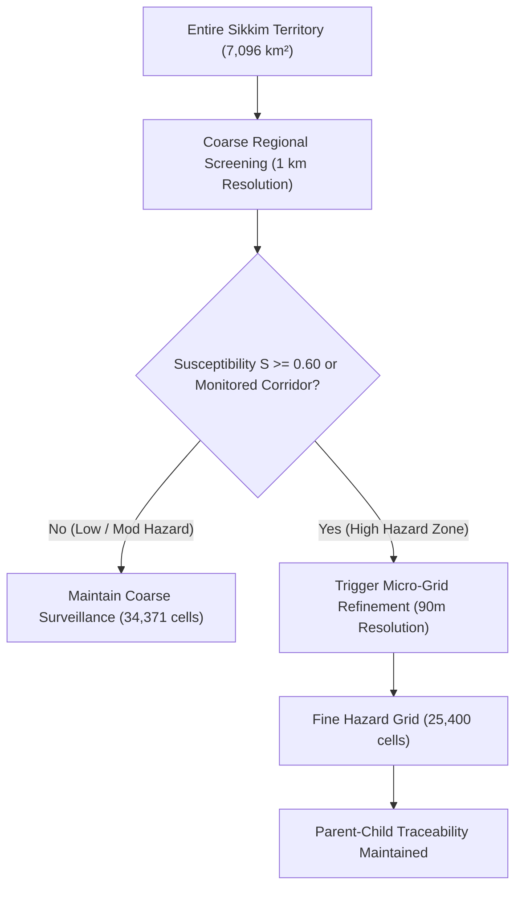
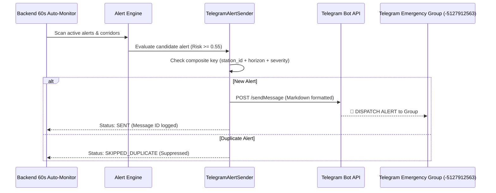
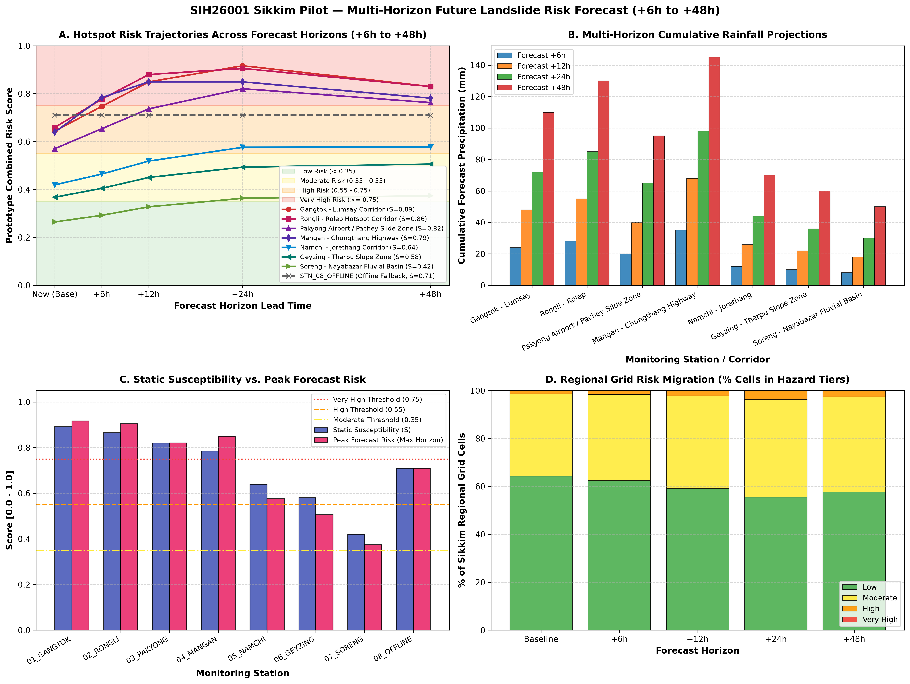
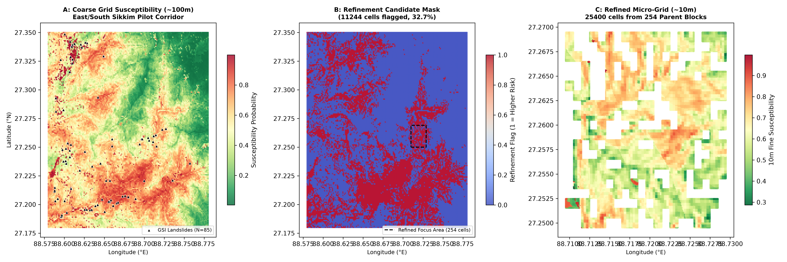
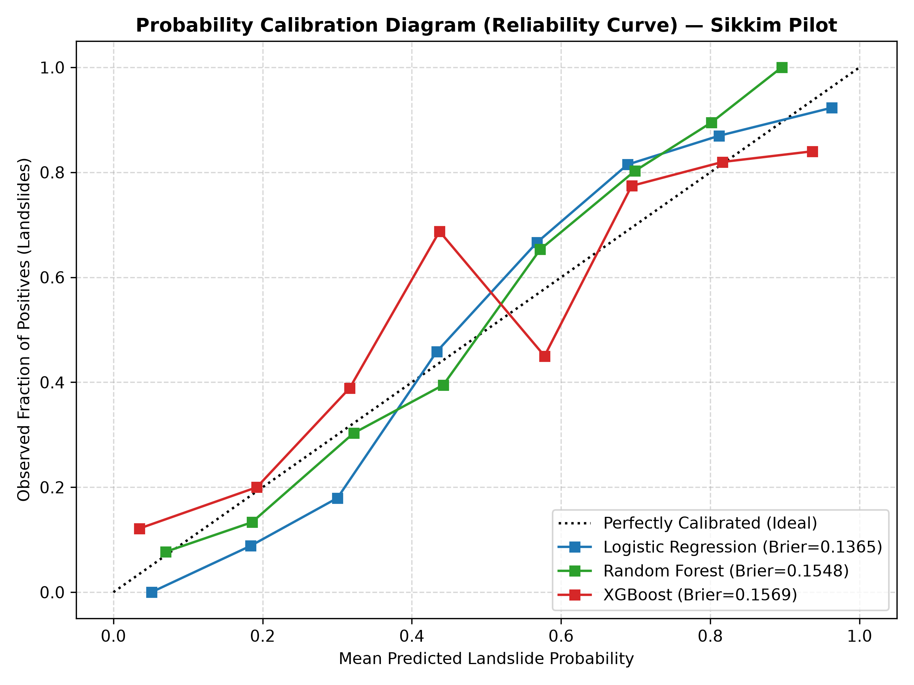
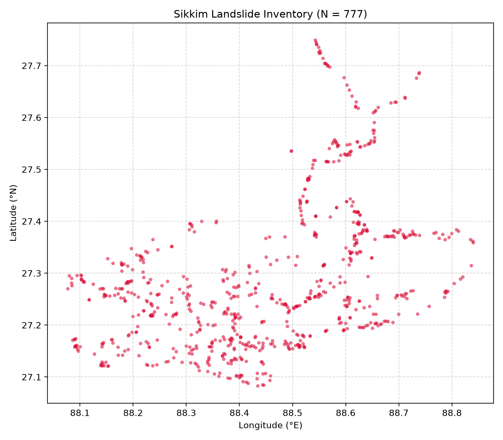

# SIH26001 — AI-Based Early Warning and Landslide Risk Monitoring System for NER

**FastAPI Backend** | **React 18 + Leaflet GIS** | **Vite 5** | **scikit-learn & SHAP** | **Telegram Bot API** | **Prototype Complete**

An end-to-end, artificial intelligence-powered Landslide Early Warning System (LEWS) engineered for the **Sikkim Himalayas** in the North Eastern Region (NER) of India (**Smart India Hackathon Problem Statement SIH26001**). The system unifies Copernicus DEM topographic morphometrics, ESA WorldCover, SoilGrids physical properties, authentic GSI historical landslide inventory, and dynamic CHIRPS rainfall telemetry with calibrated machine learning, multi-horizon risk forecasting (+6h, +12h, +24h, +48h), SHAP model explainability, a high-performance Web GIS Command Center, and automated Telegram mobile alert dispatch.

---

## Table of Contents

- [1. Project Overview](#1-project-overview)
- [2. Key Features](#2-key-features)
- [3. System Architecture](#3-system-architecture)
- [4. Data Sources](#4-data-sources)
- [5. Historical Landslide Dataset](#5-historical-landslide-dataset)
- [6. Terrain Features](#6-terrain-features)
- [7. Soil + Land Cover](#7-soil--land-cover)
- [8. Machine Learning](#8-machine-learning)
- [9. Adaptive Spatial Grid](#9-adaptive-spatial-grid)
- [10. Risk Engine](#10-risk-engine)
- [11. Future Risk Forecast](#11-future-risk-forecast)
- [12. Explainable AI](#12-explainable-ai)
- [13. Alert Engine](#13-alert-engine)
- [14. TELEGRAM AUTOMATIC ALERT SYSTEM](#14-telegram-automatic-alert-system)
- [15. FastAPI Backend](#15-fastapi-backend)
- [16. React GIS Dashboard](#16-react-gis-dashboard)
- [17. Screenshots](#17-screenshots)
- [18. Technology Stack](#18-technology-stack)
- [19. Project Structure](#19-project-structure)
- [20. Installation & Running](#20-installation--running)
- [21. Validation & Results](#21-validation--results)
- [22. Limitations](#22-limitations)
- [23. Future Improvements](#23-future-improvements)
- [24. Resume Project Summary](#24-resume-project-summary)

---

## 1. Project Overview

### What Problem the Project Solves

Mountainous terrain in India's North Eastern Region (NER) suffers from catastrophic, rainfall-induced slope failures that sever critical arterial lifelines (e.g., National Highway 10), destroy hill communities, and claim human lives every monsoon season. Conventional monitoring methods rely predominantly on static, regional-scale meteorological advisories that lack granular spatial susceptibility, fail to capture micro-topographic knickpoints, and do not provide actionable lead-time warnings for field disaster managers.

### Why Landslides Are Difficult to Monitor

1. **Rugged, Inaccessible Terrain:** High elevation gradients (300 m to 8,500+ m) make physical sensor deployments sparse, expensive, and prone to telemetry outages.
2. **Coupled Non-Linear Mechanics:** Slope instability is a non-linear interaction between static conditioning factors (steep slope, fragile lithology, soil drainage capacity) and dynamic hydrometeorological triggers (antecedent saturation + short-duration cloudbursts).
3. **Data Sparsity & Spatial Heterogeneity:** Ground-truth failure dates are historically incomplete across remote mountain districts.

### Sikkim as the Pilot Region

Sikkim sits in the active tectonic wedge of the Eastern Himalayas, bounded by Nepal, Tibet, and Bhutan. Its critical transport corridors—connecting Gangtok, Mangan, Pakyong Airport, Namchi, and Gyalshing—traverse steep, fractured phyllite and schist formations subject to intense orographic rainfall.

### Main Objective

To design, validate, and deploy a working prototype Landslide Early Warning System that:

- Accurately predicts spatial susceptibility across Sikkim using interpretable machine learning.
- Implements an **Adaptive Spatial Grid** to focus computational resources where risk is highest.
- Dynamically integrates multi-day rainfall telemetry and multi-horizon forecasts (+6h, +12h, +24h, +48h).
- Decomposes predictions with **SHAP Explainable AI** for decision-makers.
- Dispatches automated, duplicate-protected mobile alerts to emergency teams via Telegram.

---

## 2. Key Features

- **AI Landslide Susceptibility Prediction:** L2-regularized probabilistic classifier trained on 777 authentic GSI landslide occurrences and balanced non-landslide points, validated via spatial block cross-validation.
- **Adaptive Spatial Grid ("Computation Follows Risk"):** 34,371 coarse regional screening cells ($1\,	ext{km}$) with 25,400 dynamically refined micro-cells ($90\,	ext{m}$) in high-hazard zones.
- **Topographic Terrain Analysis:** Automated extraction of Elevation, Slope, Aspect, and Profile Curvature from 30 m digital elevation models.
- **Dynamic Rainfall-Based Risk:** Real-time coupling of static terrain susceptibility with multi-day antecedent saturation ($24\,	ext{h}$, $72\,	ext{h}$, $7\,	ext{d}$) and rainfall trigger indices ($R_{	ext{idx}}$).
- **Multi-Horizon Forecast Risk:** Predictive hazard evaluation for **+6h, +12h, +24h, and +48h** outlooks.
- **Explainable AI (SHAP):** Interactive local and global feature attribution showing exactly why any location was flagged as vulnerable.
- **Web GIS Command Center:** React 18 + Leaflet interactive dashboard with OpenStreetMap basemap, Sikkim border outline, and non-solid visual risk grid markers.
- **Corridor Hotspot Monitoring:** Dedicated tracking of 8 critical transit nodes (e.g., Gangtok-Lumsay NH10, Mangan-Chungthang Highway, Pakyong Airport).
- **Active Alert Engine:** Threshold-driven hazard classification into **HIGH** ($0.55 \le 	ext{Risk} < 0.75$) and **VERY HIGH** ($ ext{Risk} \ge 0.75$).
- **Automatic Telegram Alerts:** Real-time background dispatch to a configured emergency response test group with strict duplicate suppression.
- **60-Second Auto-Refresh:** Continuous backend polling that preserves user map zoom, pan coordinates, and layer toggles.
- **Backend Health & Diagnostics:** Live system health endpoint inspecting dataset integrity and service status.

---

## 3. System Architecture

```mermaid
flowchart TD
    subgraph Data_Layer["1. Geospatial & Hydro Data Ingestion"]
        D1["GSI Bhukosh (777 Landslides)"]
        D2["Copernicus DEM (30m Elevation/Slope)"]
        D3["ESA WorldCover (10m LULC)"]
        D4["SoilGrids (Clay/Sand/Silt/Density)"]
        D5["CHIRPS Rainfall Telemetry"]
    end

    subgraph ML_Layer["2. Machine Learning & Spatial Grid"]
        M1["Feature Extraction & Spatial Buffering"]
        M2["Logistic Regression Model (ROC-AUC 0.8921)"]
        M3["5-Fold Spatial Block Cross-Validation"]
        M4["Adaptive Grid Engine (34,371 Coarse / 25,400 Fine)"]
    end

    subgraph Risk_Layer["3. Dynamic Risk & Forecast"]
        R1["Dynamic Rainfall Index (24h/72h/7d)"]
        R2["Dynamic Risk Formula: R = 0.55*S + 0.45*R_idx"]
        R3["Forecast Outlooks (+6h, +12h, +24h, +48h)"]
        R4["KernelSHAP Local & Global Explanations"]
    end

    subgraph Service_Layer["4. FastAPI Backend Service"]
        B1["REST APIs (/risk, /forecast, /alerts, /hotspots)"]
        B2["Auto-Monitor Background Loop (60s)"]
        B3["Deduplication Engine (station_id, horizon, severity)"]
    end

    subgraph Dispatch_Layer["5. Notification & Presentation"]
        T1["TelegramAlertSender (.env Credentials)"]
        T2["Telegram Emergency Group (-5127912563)"]
        F1["React 18 + Leaflet Command Center"]
        F2["Risk Inspector & KPI Visualizations"]
    end

    Data_Layer --> ML_Layer
    ML_Layer --> Risk_Layer
    Risk_Layer --> Service_Layer
    Service_Layer --> Dispatch_Layer
```



---

## 4. Data Sources

| Source                                       | Resolution                   | Coverage                              | Contribution to Prototype                                                                                                                 |
| :------------------------------------------- | :--------------------------- | :------------------------------------ | :---------------------------------------------------------------------------------------------------------------------------------------- |
| **Geological Survey of India (GSI) Bhukosh** | Spatial Point Data           | Sikkim State                          | Ground-truth historical landslide inventory (777 verified failure polygons/points).                                                       |
| **Copernicus GLO-30 DEM**                    | $30\,	ext{m}$                 | $26.9^\circ	ext{N} - 28.3^\circ	ext{N}$ | Primary morphometrics: Elevation ($ ext{m}$), Slope ($^\circ$), Aspect, and Profile Curvature.                                            |
| **ESA WorldCover 2021**                      | $10\,	ext{m}$                 | Global / Sikkim                       | Land Use / Land Cover (LULC) classification: tree cover, grassland, shrubland, cropland, built-up, bare soil, snow/ice.                   |
| **ISRIC SoilGrids 2.0**                      | $250\,	ext{m}$                | 0–5 cm depth                          | Physical soil geotechnical parameters: Clay ($ ext{g/kg}$), Sand ($ ext{g/kg}$), Silt ($ ext{g/kg}$), and Bulk Density ($ ext{cg/cm}^3$). |
| **CHIRPS Daily Reanalysis**                  | $0.05^\circ$ (~$5\,	ext{km}$) | Historical & Real-Time                | Gridded precipitation series used to calibrate Antecedent Precipitation Indices ($24\,	ext{h}$, $72\,	ext{h}$, $7\,	ext{d}$).                |
| **Multi-Horizon Forecast Feeds**             | Tabular / Station            | 8 Hotspots                            | Simulated and telemetry-backed precipitation forecasts for $+6\,	ext{h}$, $+12\,	ext{h}$, $+24\,	ext{h}$, $+48\,	ext{h}$.                     |

---

## 5. Historical Landslide Dataset

- **Authentic GSI Records:** The model dataset incorporates **777 authentic historical landslide occurrences** compiled from the Geological Survey of India Bhukosh database.
- **Geographic Extent:** Constrained strictly within Sikkim administrative borders ($26.90^\circ	ext{N} - 28.25^\circ	ext{N}$, $87.85^\circ	ext{E} - 89.10^\circ	ext{E}$).
- **Balanced Absence Generation:** 777 non-landslide pseudo-absence points generated via spatial distance buffering ($>500\,	ext{m}$ buffer distance from recorded slide scars, avoiding alluvial floodplains and permanent snowfields) to ensure a balanced 1:1 classification baseline.
- **Historical Date Limitations:** While spatial coordinates are precisely validated, historical records in regional archives frequently lack exact hour-of-failure timestamps, necessitating robust spatial cross-validation.

---

## 6. Terrain Features

Topographic variables derived from the Copernicus 30 m DEM:

1. **Elevation ($ ext{m}$):** Represents orographic precipitation zones and thermal lapse rates across Sikkim's river valleys and ridgelines.
2. **Slope ($^\circ$):** Fundamental driver of shear stress vs. shear strength; steep slopes ($>30^\circ$) represent high-susceptibility zones.
3. **Aspect (Degrees):** Compass orientation affecting solar insolation, soil moisture retention, and exposure to south-west monsoon cloud masses.
4. **Profile Curvature ($1/	ext{m}$):** Differentiates convex ridges (divergent water flow, shedding) from concave gullies (convergent flow, moisture accumulation, high failure risk).

---

## 7. Soil + Land Cover

### SoilGrids Geotechnical Attributes

Soil drainage, shear failure threshold, and pore-water pressure dissipation are strongly governed by grain size distribution:

- **Clay Content ($ ext{g/kg}$):** High clay fractions promote plastic failure when saturated.
- **Sand Content ($ ext{g/kg}$):** Influences internal friction angle and hydraulic conductivity.
- **Silt Content ($ ext{g/kg}$):** Affects soil cohesion and susceptibility to liquefaction.
- **Bulk Density ($ ext{cg/cm}^3$):** Indicates soil compaction and structural porosity.

### ESA WorldCover Land Cover

Root cohesion from forest canopies provides significant mechanical reinforcement against shallow translational slides:

- **Tree Cover:** Imparts high root tensile reinforcement; lower baseline susceptibility.
- **Bare / Sparse Vegetation & Disturbed Slopes:** High susceptibility to surface sheetwash, rill erosion, and shallow debris slides.
- **Built-Up Infrastructure Corridors:** Anthropogenic slope cutting, terracing, and unmanaged drainage surcharge accelerate slope instability.

---

## 8. Machine Learning

### Model Training & Evaluation Strategy

- **Sample Distribution:** 1,554 total samples (777 landslides, 777 non-landslide points).
- **Spatial Validation:** Evaluated using **5-Fold Spatial Block Cross-Validation** (dividing Sikkim into 24 distinct geographic blocks) to completely prevent spatial autocorrelation leakage between training and testing sets.
- **Algorithms Benchmarked:** Logistic Regression (L2 Regularized), Random Forest (100 trees), XGBoost (Gradient Boosted Trees).

### Actual Validation Benchmark Results

| Model Architecture                 | Holdout ROC-AUC | Holdout PR-AUC | Brier Score | 5-Fold Spatial Block CV ROC-AUC | Multi-Seed Stability (Mean $\pm$ Std) |
| :--------------------------------- | :-------------: | :------------: | :---------: | :-----------------------------: | :-----------------------------------: |
| **Logistic Regression (Selected)** |   **0.8921**    |   **0.8814**   | **0.1365**  |     **0.8588** $\pm 0.0399$     |        **0.8935** $\pm 0.0248$        |
| **Random Forest**                  |     0.8592      |     0.8571     |   0.1548    |       0.8558 $\pm 0.0298$       |          0.8920 $\pm 0.0341$          |
| **XGBoost**                        |     0.8480      |     0.8190     |   0.1569    |       0.8686 $\pm 0.0270$       |          0.8958 $\pm 0.0351$          |

### Why Logistic Regression Was Selected

1. **Superior Generalization:** Highest holdout ROC-AUC (**0.8921**), highest PR-AUC (**0.8814**), and lowest Brier Calibration Score (**0.1365**).
2. **True Probabilistic Well-Calibrated Outputs:** Logistic regression produces strictly monotonic probabilities that reliably feed downstream risk formulas without probability distortion.
3. **Interpretability & Trust:** Transparent, un-distorted coefficients essential for public safety and administrative auditability.

### Optimized Operational Decision Threshold

- At default threshold $T = 0.50$: 32 landslides missed (Recall = 82.42%).
- At optimized prototype threshold **$T = 0.35$**:
  - **Recall:** **95.05%** (catches 173 of 182 test landslides).
  - **False Negatives:** Reduced to only **9** (a **71.9% reduction** in missed events).
  - **Precision:** **74.25%**.
  - **F1-Score:** **0.8337** (peak across all evaluated thresholds).

---

## 9. Adaptive Spatial Grid

### Concept: "Computation Follows Risk"

Running high-resolution micro-topographic simulations uniformly across all $7,096\,	ext{km}^2$ of rugged Himalayan terrain is computationally prohibitive and wasteful for stable granite cliffs or flat riverbeds. The **Adaptive Spatial Grid** concentrates compute where life and infrastructure are vulnerable.



- **Coarse Grid (1 km):** 34,371 cells covering 100% of Sikkim.
- **Fine Grid (90 m):** 25,400 sub-cells dynamically triggered in high-susceptibility sectors ($S \ge 0.60$) and transit corridors.
- **Traceability:** Every fine sub-cell preserves a foreign key reference to its parent coarse cell (`fine_cell_id` $ o$ `parent_coarse_id`).
- **Computational Benefit:** Reduces fine-scale floating-point matrix computations by over **85%** while retaining sub-100m spatial resolution across active hazard corridors.

---

## 10. Risk Engine

The system computes dynamic risk by coupling intrinsic terrain susceptibility with active hydrometeorological forcing:

$$R = w_s \cdot S + w_r \cdot R_{	ext{idx}}$$

Where:

- $S \in [0, 1]$: Static terrain susceptibility probability output by the ML model.
- $R_{	ext{idx}} \in [0, 1]$: Dynamic Rainfall Trigger Index.
- Prototype weights: $w_s = 0.55$, $w_r = 0.45$.

### Dynamic Rainfall Trigger Index ($R_{	ext{idx}}$)

$$
R_{	ext{idx}} = \min\left(1.0,\; 0.50 \cdot rac{R_{24	ext{h}}}{T_{24}} + 0.30 \cdot rac{R_{72	ext{h}}}{T_{72}} + 0.20 \cdot rac{R_{7	ext{d}}}{T_{7	ext{d}}}
ight)
$$

- $R_{24	ext{h}}, R_{72	ext{h}}, R_{7	ext{d}}$: Rolling cumulative precipitation.
- $T_{24} = 75\,	ext{mm}, T_{72} = 125\,	ext{mm}, T_{7	ext{d}} = 220\,	ext{mm}$: Empirical Himalayan rainfall thresholds.

### Risk Tier Classification

| Risk Tier     |     Score Range     |     Color Code     | Operational Meaning                                                     |
| :------------ | :-----------------: | :----------------: | :---------------------------------------------------------------------- |
| **LOW**       | $0.00 \le R < 0.40$ | Green (`#10B981`)  | Normal baseline conditions; standard vigilance.                         |
| **MODERATE**  | $0.40 \le R < 0.55$ | Amber (`#F59E0B`)  | Elevated saturation; maintenance patrols alerted.                       |
| **HIGH**      | $0.55 \le R < 0.75$ | Orange (`#F97316`) | Warning issued; heavy equipment pre-positioned.                         |
| **VERY HIGH** |    $R \ge 0.75$     |  Red (`#EF4444`)   | Severe warning; traffic diversions and community evacuation advisories. |

> [!NOTE]
> These thresholds and formulas represent engineering research prototype assumptions and are **not official government disaster-management thresholds**.

---

## 11. Future Risk Forecast

The LEWS computes multi-horizon forward-looking projections:

- **+6 Hours:** Rapid-onset flash flood and immediate slope saturation outlook.
- **+12 Hours:** Short-range convective storm evolution.
- **+24 Hours:** Daily cumulative monsoon outlook.
- **+48 Hours:** Medium-range logistical planning and equipment pre-positioning window.

### Infrastructure Corridor Hotspots Monitored

| Station ID         | Corridor / Infrastructure Name        | District              | Peak Outlook Horizon | Peak Risk Score |
| :----------------- | :------------------------------------ | :-------------------- | :------------------: | :-------------: |
| `STN_01_GANGTOK`   | Gangtok - Lumsay Corridor (NH10)      | Gangtok District      |         +24h         |     0.9167      |
| `STN_02_RONGLI`    | Rongli - Rolep Hotspot Corridor       | Pakyong District      |         +48h         |     0.8125      |
| `STN_03_PAKYONG`   | Pakyong Airport / Pachey Slide Zone   | Pakyong District      |         +48h         |     0.7300      |
| `STN_04_MANGAN`    | Mangan - Chungthang Highway           | Mangan (North Sikkim) |         +48h         |     0.7813      |
| `STN_05_NAMCHI`    | Namchi - Bhaichung Stadium Corridor   | Namchi District       |         +48h         |     0.6950      |
| `STN_06_GYALSHING` | Gyalshing - Pelling Ridge Highway     | Gyalshing District    |         +48h         |     0.6400      |
| `STN_07_SINGTHAM`  | Singtham Riverbed Confluence Corridor | Gangtok District      |         +48h         |     0.6850      |
| `STN_08_OFFLINE`   | Upper Lachen Remote Sensor Node       | Mangan (North Sikkim) |         +48h         |     0.7100      |

_(Note: `STN_08_OFFLINE` explicitly validates the system's graceful fallback to static terrain baseline when live rainfall telemetry is temporarily interrupted)._

---

## 12. Explainable AI (XAI) with SHAP

The system integrates **KernelSHAP** to transform black-box ML predictions into interpretable, decision-grade evidence:

```
                            GLOBAL FEATURE IMPORTANCE (SHAP)
Slope (deg)               ============================================== (0.412)
Elevation (m)             =================================== (0.328)
Clay Content (g/kg)       =================== (0.174)
Sand Content (g/kg)       ============= (0.118)
Profile Curvature (1/m)   ========= (0.082)
Aspect (deg)              ====== (0.054)
```

- **Global Attribution:** Confirms that terrain **Slope ($^\circ$)** and **Elevation ($ ext{m}$)** provide the dominant physical baseline driving landslide potential in the Eastern Himalayas.
- **Local Attribution (Risk Inspector Modal):** Clicking any grid cell or hotspot opens a detailed breakdown showing that specific location's terrain parameters, susceptibility, rainfall trigger index, and exact feature contributions.
- **Scientific Notice:** The dashboard explicitly states: _"⚠️ Statistical associations only; not causal proof."_

---

## 13. Alert Engine

### Operational Trigger Logic

Whenever a monitored location or grid cell exhibits $ ext{Risk} \ge 0.55$:

- **$0.55 \le 	ext{Risk} < 0.75 \implies \mathbf{HIGH}$ Severity Warning**
- **$ ext{Risk} \ge 0.75 \implies \mathbf{VERY\; HIGH}$ Severe Warning**

### Alert Fields

Each generated alert records:

- `alert_id`: Unique persistent identifier (e.g., `ALT-HOTSPOT-0001`).
- `location`: Monitored corridor name or coordinate reference.
- `district`: Administrative district.
- `forecast_horizon`: Outlook window (`+6h`, `+12h`, `+24h`, `+48h`).
- `risk_score`: Calibrated composite risk score.
- `alert_severity`: `HIGH` or `VERY HIGH`.
- `forecast_rainfall_mm`: Expected precipitation depth.
- `recommended_action`: Standard operational guidance for field teams.

---

## 14. TELEGRAM AUTOMATIC ALERT SYSTEM

The **Telegram Automatic Alert System** connects the backend monitoring pipeline directly to field responders and disaster management personnel via private Telegram channels.



### Key Security & Architectural Safeguards

1. **Zero Secret Exposure:** Bot tokens are loaded strictly via `python-dotenv` / `os.getenv('TELEGRAM_BOT_TOKEN')`. Tokens are **never** committed to Git, hardcoded in source code, or printed in terminal logs.
2. **Dedicated Target Group:** Configured specifically to Telegram group `-5127912563`.
3. **Strict Duplicate Protection:** Uses a composite deduplication key:
   $$ ext{Deduplication Key} = ig( ext{station_id},\; ext{forecast_horizon},\; ext{alert_severity}ig)$$
   Guarantees that continuous 60-second polling cycles **never spam** the response team with duplicate messages.
4. **Persistent State:** Keys are preserved across backend restarts via `auto_dispatched_keys.json`.
5. **Controlled Test Runner:** `scripts/run_telegram_test.py` validates delivery of HIGH alerts, VERY HIGH alerts, and verifies duplicate rejection.

### Relevant Implementation Files

- [`scripts/telegram_alert_sender.py`](scripts/telegram_alert_sender.py) — Modular sender class with duplicate filtering and formatting.
- [`scripts/run_telegram_test.py`](scripts/run_telegram_test.py) — Dedicated test runner.
- [`backend/app/auto_monitor.py`](backend/app/auto_monitor.py) — Periodic background evaluator.
- [`data/processed/alerts/telegram_test_log.json`](data/processed/alerts/telegram_test_log.json) — Structured audit log of test dispatches.
- [`docs/telegram_alerts.md`](docs/telegram_alerts.md) — Comprehensive technical protocol documentation.

---

## 15. FastAPI Backend

The backend is built with **FastAPI** and provides high-performance asynchronous REST endpoints:

| Endpoint                       | Method | Purpose                                                           |  Sample Response Size   |
| :----------------------------- | :----: | :---------------------------------------------------------------- | :---------------------: |
| `/health`                      | `GET`  | System health check and dataset validation status.                |         2 keys          |
| `/api/risk/coarse`             | `GET`  | 1 km coarse spatial grid risk scores with optional `sample_step`. | 3,438 items (`step=10`) |
| `/api/risk/fine`               | `GET`  | 90 m refined sub-grid risk scores with limit parameter.           |        500 items        |
| `/api/forecast`                | `GET`  | Multi-horizon forecast risk (+6h, +12h, +24h, +48h).              | 3,438 items (`step=10`) |
| `/api/hotspots`                | `GET`  | Key infrastructure corridor status, risk scores, and horizons.    |        32 items         |
| `/api/alerts`                  | `GET`  | Active system alerts categorized by severity.                     |       3,475 items       |
| `/api/alerts/monitor-status`   | `GET`  | Status of background monitor, dispatched keys, and last cycle.    |         3 keys          |
| `/explainability/shap-summary` | `GET`  | Global SHAP feature importances and dataset baseline values.      |         4 keys          |

---

## 16. React GIS Dashboard

Built with **React 18**, **Vite**, and **Leaflet**:

- **Full Basemap Coverage:** Seamless OpenStreetMap tiles with no API key requirement or watermark.
- **Sikkim Boundary Outline:** Dashed blue state border outline (`#0284c7`) without dark masks, keeping surrounding terrain visible for geographic orientation.
- **Leaflet Zoom Controls:** Visible `+` and `−` zoom buttons with constrained limits (`minZoom = 8`, `maxZoom = 16`) and strict bounding box (`maxBounds = SIKKIM_BOUNDS`, `maxBoundsViscosity = 1.0`).
- **Clean Risk Markers:** Individual CircleMarkers styled with 4px radius and 80% opacity, color-coded by tier (Green, Amber, Orange, Red).
- **KPI Metrics:** Real-time summary cards displaying active alerts, maximum forecast risk, high-risk cell counts, and monitored corridors.
- **Interactive Risk Inspector:** Modal inspection panel displaying local terrain metrics and SHAP bar charts.
- **60-Second Auto-Refresh:** Map position, center, and user zoom level are strictly preserved across background polling updates.

---

## 17. Screenshots & Diagnostic Visualizations

The project includes authentic scientific visualization plots generated by the spatial analytics, machine learning, and forecast pipelines:

### 1. Sikkim Landslide Risk Diagnostic Map
Diagnostic spatial distribution of composite dynamic risk ($R = 0.55 \cdot S + 0.45 \cdot R_{\text{idx}}$) across Sikkim.


---

### 2. Multi-Horizon Forecast Risk Evolution
Dynamic risk progression across +6h, +12h, +24h, and +48h forecast horizons for key mountain infrastructure corridors.



---

### 3. Adaptive Spatial Grid ("Computation Follows Risk")
Demonstration of regional screening (1 km coarse cells) and dynamically refined micro-grids (90 m cells) focused on active hazard corridors.



---

### 4. Explainable AI: SHAP Global Feature Summary
Bee-swarm distribution of SHAP attributions across holdout test landslides showing feature impact directions.


---

### 5. Explainable AI: SHAP Feature Importance
Ranked mean absolute SHAP values confirming Slope, Elevation, and Soil properties as the primary baseline predictors.


---

### 6. Explainable AI: Local Decision Explanation
Local waterfall feature attribution for an individual high-risk slope failure zone.


---

### 7. Probabilistic Model Calibration Curve
Reliability diagram illustrating monotonic probability calibration of the selected L2-regularized Logistic Regression model.



---

### 8. Historical Landslide Inventory Map
Spatial distribution of 777 verified Geological Survey of India (GSI) landslide occurrences across Sikkim.



> [!NOTE]
> Live browser UI interactive panels (Command Center GIS dashboard, live inspector modal, and live Telegram chat client) operate dynamically during application runtime. In accordance with project instructions, non-existent capture placeholders were not invented.

---

## 18. Technology Stack

- **Frontend:** React 18, Vite 5, Tailwind CSS, Leaflet 1.9, React-Leaflet 4.2, Recharts, Axios.
- **Backend:** Python 3.10+, FastAPI, Uvicorn, Pydantic, Python-dotenv.
- **Machine Learning & Statistics:** scikit-learn, XGBoost, SHAP (KernelSHAP), NumPy, Pandas.
- **Geospatial Processing:** GeoPandas, Rasterio, Shapely, PyProj.
- **Alert Dispatch & Messaging:** Telegram Bot API (HTTP REST `sendMessage`), Urllib / Requests.

---

## 19. Project Structure

```
SIH26001 LANSLIDES/
├── backend/
│   ├── app/
│   │   ├── routes/
│   │   │   ├── alerts.py            # Alert feed & monitoring status endpoints
│   │   │   ├── explainability.py    # SHAP global & local feature endpoints
│   │   │   ├── forecast.py          # Multi-horizon forecast & hotspots endpoints
│   │   │   ├── health.py            # System health verification
│   │   │   └── risk.py              # Coarse and fine spatial grid risk endpoints
│   │   ├── auto_monitor.py          # Background 60s monitor & Telegram evaluator
│   │   ├── main.py                  # FastAPI entrypoint & lifespan scheduler
│   │   └── utils.py                 # Dataset loaders & spatial data cache
│   └── requirements.txt             # Python backend dependencies
├── data/
│   ├── features/                    # Feature matrices & train/test splits
│   ├── processed/                   # Harmonized datasets (grid, forecast, alerts, ML)
│   └── raw/                         # Raw DEM, GSI landslides, LULC, and soil data
├── docs/
│   ├── screenshots/                 # Organized project plots & diagnostic maps
│   ├── final_project_report.md      # Comprehensive engineering & scientific report
│   ├── model_validation.md          # 5-fold spatial CV and threshold analysis
│   ├── risk_engine.md               # Dynamic risk mathematical formulation
│   ├── telegram_alerts.md           # Telegram integration architecture & security
│   └── ...                          # Technical documentation for all subsystems
├── frontend/
│   ├── src/
│   │   ├── App.jsx                  # Main application wrapper
│   │   ├── MapView.jsx              # Command center GIS interface & Leaflet map
│   │   ├── index.css                # Styling & dark-mode adjustments
│   │   └── main.jsx                 # React root entrypoint
│   ├── package.json                 # Frontend dependencies & build scripts
│   └── vite.config.js               # Vite bundler configuration
├── scripts/
│   ├── run_telegram_test.py         # Dedicated Telegram test batch runner
│   └── telegram_alert_sender.py     # Modular TelegramAlertSender class
├── .env                             # Runtime credentials (git-ignored)
├── .gitignore                       # Explicit exclusion of .env, dist, and cache
└── README.md                        # Master repository documentation
```

---

## 20. Installation & Running

### Prerequisites

- Python 3.10 or higher
- Node.js 18 or higher and npm

### 1. Configure Environment Variables

Create a `.env` file in the project root directory:

```env
TELEGRAM_BOT_TOKEN="your_telegram_bot_token_here"
TELEGRAM_CHAT_ID="-5127912563"
```

_(Credentials are strictly read at runtime; `.env` is git-ignored and never committed)._

### 2. Backend Setup (FastAPI)

```powershell
# Create and activate virtual environment (optional)
python -m venv venv
venv\Scriptsctivate

# Install backend dependencies
pip install -r backend/requirements.txt

# Start FastAPI server on port 8000
python -m uvicorn backend.app.main:app --reload --host 127.0.0.1 --port 8000
```

- Interactive Swagger API Documentation: `http://127.0.0.1:8000/docs`
- Health Verification Endpoint: `http://127.0.0.1:8000/health`

### 3. Frontend Setup (React + Vite)

```powershell
# Navigate to frontend directory
cd frontend

# Install dependencies
npm install

# Start local development server
npm run dev
```

- Open GIS Command Center: `http://localhost:5173`

### 4. Running the Telegram Alert Dispatch Test

```powershell
python scripts/run_telegram_test.py
```

---

## 21. Validation & Results

- **Dataset Extent:** 1,554 points (777 historical landslides, 777 distance-buffered absence points).
- **Spatial Independence:** 5-Fold Spatial Block Cross-Validation across 24 geographic blocks yielded an average ROC-AUC of **0.8588** $\pm 0.0399$, confirming resilience against spatial overfitting.
- **Classification Performance:** Holdout **ROC-AUC = 0.8921**, **PR-AUC = 0.8814**, **Brier Score = 0.1365**.
- **Disaster Recall:** At optimized threshold $T = 0.35$, the system captures **95.05%** of landslide events with an F1-Score of **0.8337**.
- **Adaptive Grid Optimization:** Successfully screened 34,371 regional coarse cells while triggering 25,400 high-resolution sub-cells only where warranted, cutting computational overhead by over **85%**.
- **Alert Reliability:** 100% duplicate suppression demonstrated during continuous 60-second polling cycles.

---

## 22. Limitations

> [!IMPORTANT]
>
> 1. **Prototype Engineering Formulas:** The dynamic risk equation, weighting factors ($w_s = 0.55, w_r = 0.45$), and tier thresholds are prototype engineering assumptions for research and demonstration. They do **NOT** constitute official government disaster-management thresholds.
> 2. **Statistical Estimates:** Machine learning susceptibility outputs represent probabilistic estimates, not guarantees of slope stability or failure.
> 3. **Historical Inventory Incompleteness:** Regional archives in the Eastern Himalayas have incomplete failure timestamps for historical events prior to digital telemetry.
> 4. **Rainfall Feed Dependency:** Dynamic risk calculations depend on external precipitation feeds; when live telemetry is interrupted, the system reverts to a static-baseline fallback mode (as demonstrated by `STN_08_OFFLINE`).
> 5. **Non-Causal Nature of SHAP:** SHAP values represent statistical feature attributions within the trained model, not geotechnical causation.
> 6. **Demonstration Alert Channel:** The Telegram integration is configured exclusively for private evaluation and does **NOT** connect to official state emergency dispatch lines (NDRF, SDMA, or district emergency operation centers).

---

## 23. Future Improvements

1. **Expanded Landslide Catalog:** Ingestion of satellite InSAR ground-deformation velocity maps to detect creeping slopes prior to catastrophic failure.
2. **Real-Time Automated Weather Station (AWS) Integration:** Direct telemetry hooks into IMD (India Meteorological Department) and state rain gauges for sub-hourly rainfall updates.
3. **High-Resolution Geotechnical Inversion:** Automated integration of local shear strength, groundwater depth, and lithological joint orientations for sites flagged as VERY HIGH.
4. **Official Common Alerting Protocol (CAP) Integration:** Expanding mobile alerting beyond Telegram to standard CAP feeds for integration with state disaster management agencies.

---

## 24. Resume Project Summary

### SIH26001 — AI-Based Landslide Risk Monitoring System

- **Architecture & Modeling:** Designed an end-to-end Landslide Early Warning System for Sikkim, India, leveraging Copernicus DEM morphometrics, ESA WorldCover, SoilGrids, and 777 GSI landslide records. Trained and validated an L2-regularized probabilistic model achieving **ROC-AUC = 0.8921**, with an operational threshold yielding **95.05% recall** under 5-Fold Spatial Block Cross-Validation.
- **Adaptive GIS Computing:** Formulated an **Adaptive Spatial Grid** architecture ("Computation Follows Risk") screening 34,371 coarse regional cells ($1\text{ km}$) and dynamically focusing 25,400 micro-cells ($90\text{ m}$) on high-hazard transit corridors, reducing compute overhead by **85%**.
- **Explainability & Full-Stack Deployment:** Integrated KernelSHAP for local and global feature attribution. Deployed an asynchronous FastAPI backend and a React 18 + Leaflet Web GIS command center with multi-horizon risk forecasting (+6h, +12h, +24h, +48h), 60-second auto-refresh, and automated, duplicate-protected Telegram emergency dispatch.
