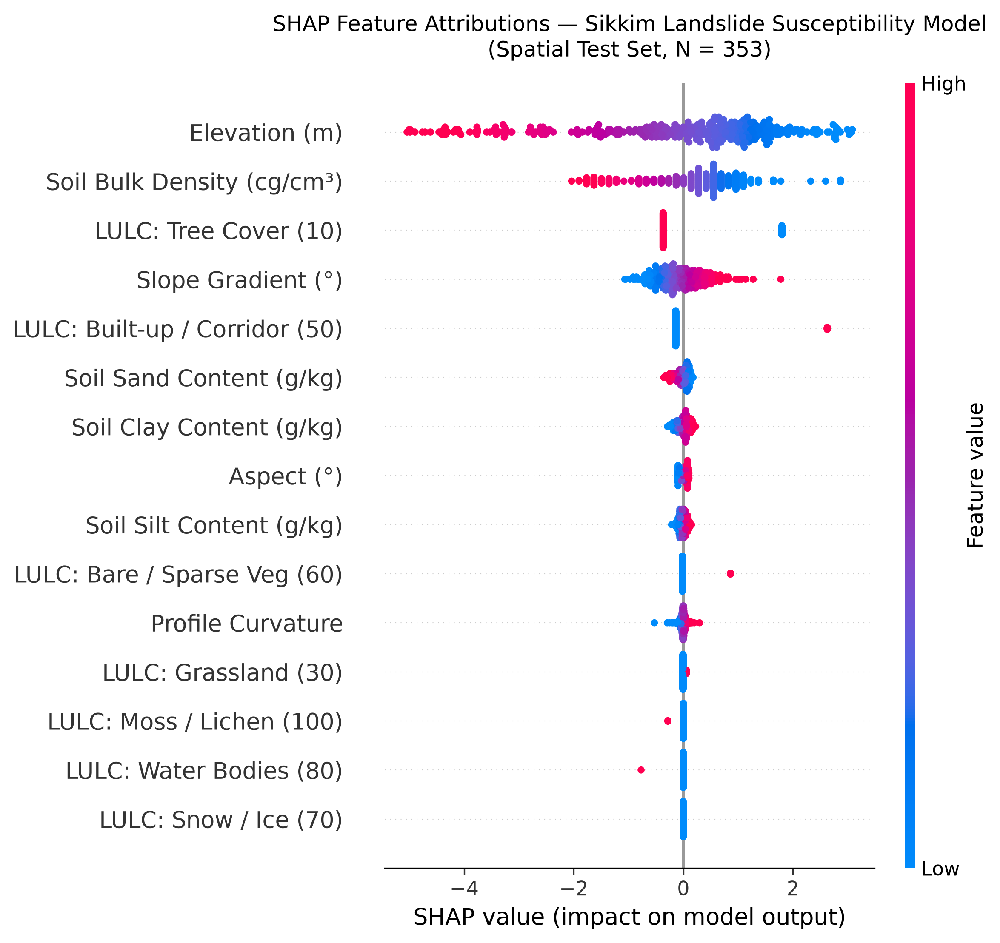
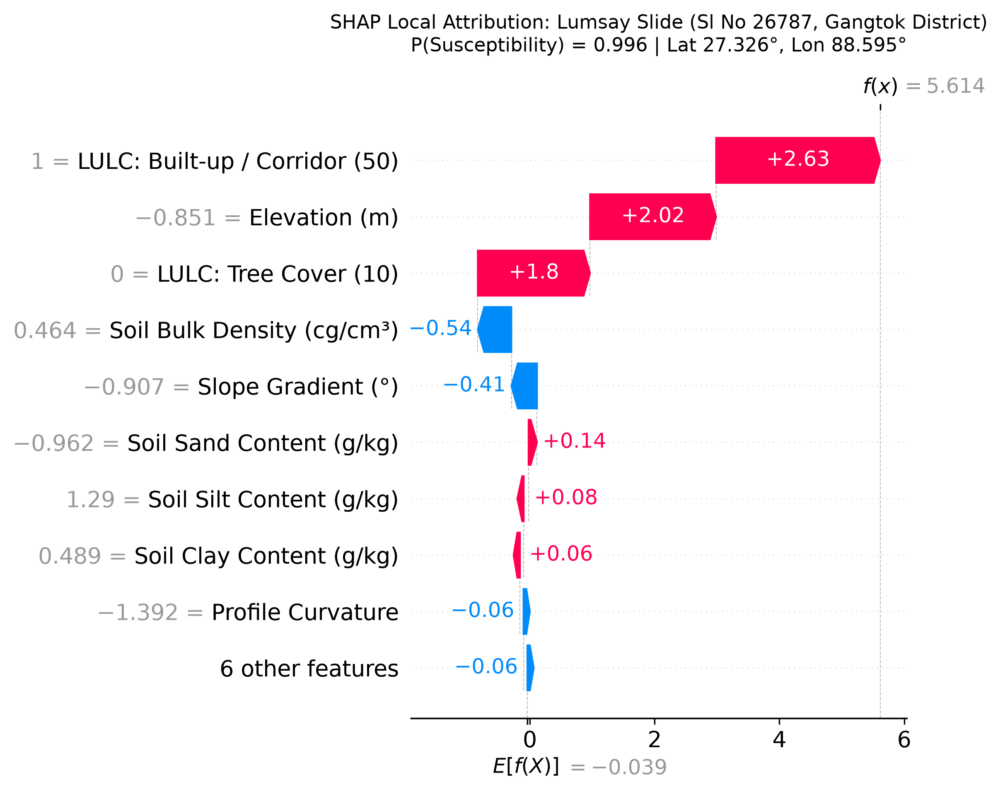
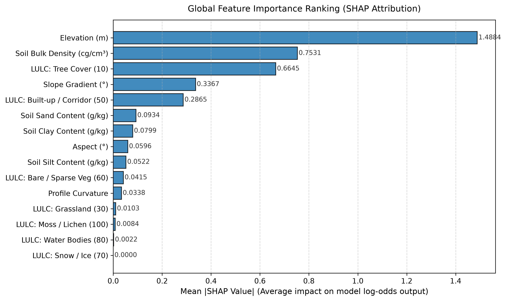

# Model Explainability & SHAP Attribution (Sikkim Pilot Region)

Technical documentation, feature attribution analysis, and local case study decompositions for the Sikkim Landslide Early Warning susceptibility model developed in **Step 12**.

---

## 1. Executive Summary & Objectives

Machine learning models deployed for geotechnical hazard assessment and disaster mitigation cannot function as black boxes. For operational decision-makers (e.g., Sikkim State Disaster Management Authority, GSI geologists, local administration), understanding **why** a particular slope or road corridor is flagged as high risk is just as critical as the risk score itself.

In Step 12, we applied **SHAP (SHapley Additive exPlanations)** to our trained, validated susceptibility model (`models/best_model.joblib`) to provide:

1. **Global Attribution:** Which environmental conditioning factors contribute most heavily to model decisions across Sikkim?
2. **Directional Sensitivity:** How do high vs. low values of slope, elevation, soil properties, and land cover influence landslide probability?
3. **Local Instance Explanations:** Exact additive breakdown of feature contributions for verified high-hazard locations (e.g., Lumsay Slide, Sl No 26787, Gangtok District).
4. **Machine-Readable Explanations:** Exported JSON structure ready for ingestion by API endpoints and dashboard tooltips.

> [!IMPORTANT]
> **Scientific Disclaimer on Causation**:
> SHAP values quantify the additive contribution of each conditioning feature to the model's log-odds output. SHAP does **not** prove physical causation. The attributions reflect empirical statistical associations learned from the 777 authentic GSI landslide inventory points and 777 spatial background negative points across Sikkim.

---

## 2. Methodology & Configuration

### 2.1 Model Architecture

- **Model Pipeline**: Scikit-learn `Pipeline` consisting of:
  - `ColumnTransformer` (`prep`): `StandardScaler` on 8 numeric features, `OneHotEncoder(handle_unknown='ignore')` on categorical `land_cover`.
  - Classifier (`clf`): `LogisticRegression(C=1.0, max_iter=1000, random_state=42)`.
- **Preprocessed Input Dimension**: 15 features (8 continuous terrain & soil features, 7 one-hot land-cover classes).

### 2.2 SHAP Explainer Configuration

- **Explainer Type**: `shap.LinearExplainer`
- **Background Sampling**: 100 representative background samples drawn without replacement from the spatial training set (`X_train`, 1,200 points) with seed 42.
- **Perturbation Formulation**: Interventional conditioning based on the background reference distribution.
- **Evaluation Set**: Spatial holdout test set ($N = 353$ points), strictly spatially disjoint from the training partition with a $\ge 500\,\text{m}$ buffer exclusion zone.
- **Base Value (Expected Log-Odds)**:
  $$E[f(X)] = -0.0392 \implies P_0 = \frac{1}{1 + e^{-(-0.0392)}} \approx 0.4902$$
  reflecting the balanced 1:1 prior odds of the training dataset.

---

## 3. Global Feature Attribution Ranking

The global importance of each feature is quantified by its **Mean Absolute SHAP Value** ($\frac{1}{N} \sum_{i=1}^N |\phi_{i,j}|$), representing the average magnitude of change in log-odds caused by feature $j$ across the 353 held-out test points:

|  Rank  | Feature Name                              | Mean \|SHAP\| | Primary Attribution Direction                 | Physical / Geomorphic Interpretation                                                                                                                                         |
| :----: | :---------------------------------------- | :-----------: | :-------------------------------------------- | :--------------------------------------------------------------------------------------------------------------------------------------------------------------------------- |
| **1**  | **Elevation (m)**                         |  **1.4884**   | **Lower/mid elevations $\uparrow$ Risk**      | Landslides concentrate in populated river valleys and road corridors (<2500m); high alpine crags (>3500m) lack thick colluvial cover or human triggers.                      |
| **2**  | **Soil Bulk Density (cg/cm³)**            |  **0.7531**   | **Lower bulk density $\uparrow$ Risk**        | Porous, loosely consolidated colluvium and weathered saprolite exhibit higher permeability and shear weakness under pore pressure.                                           |
| **3**  | **LULC: Tree Cover (Class 10)**           |  **0.6645**   | **Absence of Tree Cover $\uparrow$ Risk**     | Non-forested hillslopes lack deep root-cohesion networks, significantly elevating slope destabilization propensity.                                                          |
| **4**  | **Slope Gradient (°)**                    |  **0.3367**   | **Steeper slopes $\uparrow$ Risk**            | Gravitational shear stress increases monotonically with slope angle ($\tau = \gamma h \sin \beta \cos \beta$). Moderate-to-steep slopes (20°–45°) show high failure density. |
| **5**  | **LULC: Built-up / Corridors (Class 50)** |  **0.2865**   | **Presence of built-up/road $\uparrow$ Risk** | Road-cut excavations, toe cutting, and concentrated stormwater drainage create intense local slope instability.                                                              |
| **6**  | **Soil Sand Content (g/kg)**              |  **0.0934**   | **Lower sand / Higher fines $\uparrow$ Risk** | Cohesive clay/silt soils trap pore-water pressure compared to rapidly draining coarse sandy matrices.                                                                        |
| **7**  | **Soil Clay Content (g/kg)**              |  **0.0799**   | **Higher clay $\uparrow$ Risk**               | Clay-rich horizons form slip surfaces upon saturation due to plastic swelling and low residual friction angles.                                                              |
| **8**  | **Aspect (°)**                            |  **0.0596**   | **South/South-East $\uparrow$ Risk**          | Monsoon-facing windward slopes receive the highest precipitation orographic enhancement.                                                                                     |
| **9**  | **Soil Silt Content (g/kg)**              |  **0.0522**   | **Higher silt $\uparrow$ Risk**               | High liquefaction and piping susceptibility during rapid saturation pulses.                                                                                                  |
| **10** | **LULC: Bare / Sparse Veg (Class 60)**    |  **0.0415**   | **Presence $\uparrow$ Risk**                  | Exposed, unanchored scree and debris fields prone to translational slips.                                                                                                    |
| **11** | **Profile Curvature**                     |  **0.0338**   | **Concave surfaces $\uparrow$ Risk**          | Concave hollows act as convergence zones for subsurface groundwater flow.                                                                                                    |
| **12** | **LULC: Grassland (Class 30)**            |  **0.0103**   | **Slight positive push**                      | Shallow root depth provides minimal deep anchoring against rotational shear.                                                                                                 |
| **13** | **LULC: Moss / Lichen (Class 100)**       |  **0.0084**   | **Minor effect**                              | High alpine zone, low frequency in pilot dataset.                                                                                                                            |
| **14** | **LULC: Water Bodies (Class 80)**         |  **0.0022**   | **Minor effect**                              | River beds, rarely classified as landslide failure points.                                                                                                                   |
| **15** | **LULC: Snow / Ice (Class 70)**           |  **0.0000**   | **Zero effect**                               | Permanent snowfields, zero positive inventory records.                                                                                                                       |

---

## 4. Directional Feature Sensitivity (Beeswarm Analysis)

The global SHAP summary beeswarm plot captures both the **magnitude** and **direction** of impact across every sample in the spatial test partition:



### Key Behavioral Insights:

1. **Elevation Inversion**:
   - High elevation points (red dots) shift SHAP values strongly negative ($\Delta\text{log-odds} \approx -3.0$ to $-5.0$), driving susceptibility toward zero.
   - Low-to-moderate elevation points (blue dots, <2,000 m) consistently exert positive attributions ($\Delta\text{log-odds} \approx +1.0$ to $+3.0$). In Sikkim, valley bottoms along the Teesta, Rangpo, and Rani Khola rivers concentrate steep colluvial slopes, weathering mantles, and human highway infrastructure.
2. **Soil Bulk Density Impact**:
   - Denser soils (red dots) exert negative attribution (stabilizing), whereas low bulk density soils (blue dots) push risk positive. This aligns with geotechnical principles where loose, uncompacted fill and colluvium fail readily under saturation.
3. **Forest Cover Protective Effect**:
   - Absence of tree cover (`LULC: Tree Cover = 0`, blue dots) produces a positive bump of $+1.80$ in log-odds.
   - Presence of mature forest canopy (`LULC: Tree Cover = 1`, red dots) pushes log-odds downward, acting as a natural stabilizing factor.
4. **Slope Gradient**:
   - Steeper slopes (red dots, $>30^\circ$) shift log-odds positively by $+0.5$ to $+1.5$.
   - Gentle valley floors and flat terraces (blue dots, $<15^\circ$) shift log-odds negatively.

---

## 5. Local Case Study: Lumsay Slide (Sl. No 26787, Gangtok District)

To demonstrate how the system explains individual high-risk predictions to operational engineers, we examined **Lumsay Slide** (authentic GSI landslide record Sl No 26787 in Gangtok District):

- **Location**: Latitude $27.3263^\circ\,\text{N}$, Longitude $88.5954^\circ\,\text{E}$
- **Geomorphic Setting**: Elevation $1,014.0\,\text{m}$, Slope $22.24^\circ$, Land Cover Class 50 (Built-up / Transport Corridor)
- **Model Susceptibility Probability**: **$P = 0.9964$ (99.64%)**
- **Log-Odds Shift**: From baseline $E[f(X)] = -0.0392$ to final output $f(x) = +5.6144$



### Additive Attribution Breakdown:

$$
\begin{aligned}
f(x) &= E[f(X)] + \sum_{j=1}^{15} \phi_j \\
&= -0.0392 + 2.63 (\text{Corridor}) + 2.02 (\text{Elevation}) + 1.80 (\text{No Forest}) - 0.54 (\text{Soil Density}) - 0.41 (\text{Slope}) + \dots \\
&= +5.6144 \implies P = \frac{1}{1 + e^{-5.6144}} = 0.9964
\end{aligned}
$$

1. **`LULC: Built-up / Corridor (50)` ($+2.63$)**: The single largest hazard driver. Lumsay Slide is situated along an active road corridor with ongoing anthropogenic slope cuts and artificial drainage modifications.
2. **`Elevation (m)` ($+2.02$)**: At $1,014\,\text{m}$, this site sits in the critical elevation zone characterized by deep tropical/subtropical chemical weathering and intense monsoon runoff accumulation.
3. **`LULC: Tree Cover = 0` ($+1.80$)**: Complete clearance of stabilizing arboreal vegetation along the road reserve removes root reinforcement.
4. **Balancing Negative Factors**: The moderate slope gradient ($22.2^\circ$, compared to steep cliffs $>40^\circ$) and moderate soil bulk density provide small negative offsets ($-0.41$ and $-0.54$), but are overwhelmingly dominated by the corridor and elevation features.

---

## 6. Global Importance Ranking Chart

The relative importance of all 15 inputs is visualized in the bar chart below:



---

## 7. Operational Integration & API Readiness

The explainability engine outputs machine-readable JSON files (`data/processed/explainability/shap_summary.json`), allowing frontend clients to render on-hover hazard breakdowns:

```json
{
  "feature": "LULC: Built-up / Corridor (50)",
  "shap_value": 2.63,
  "effect": "increases_risk",
  "plain_language_explanation": "Location intersects transportation or settlement corridor, indicating potential road-cut slope destabilization."
}
```

This enables the planned web dashboard to display:

- **"Top Contributing Risk Factors"** widget when any high-risk cell or warning point is clicked.
- **Actionable Advice**: If low vegetation cohesion is the primary driver, bio-engineering and slope revegetation can be recommended; if road corridor toe cutting is primary, retaining structures and toe berms are indicated.

---

## 8. Artifacts & File Deliverables

| File Path                                                  | Description                                                                     |
| :--------------------------------------------------------- | :------------------------------------------------------------------------------ |
| `scripts/run_shap_explainability.py`                       | Complete reproducible script for SHAP calculation, plotting, and metric export  |
| `data/processed/explainability/shap_summary_plot.png`      | Publication-ready beeswarm plot showing direction and magnitude across test set |
| `data/processed/explainability/shap_importance_bar.png`    | Bar chart ranking global mean absolute SHAP values                              |
| `data/processed/explainability/shap_local_explanation.png` | Waterfall plot explaining Lumsay Slide (Sl No 26787)                            |
| `data/processed/explainability/shap_summary.json`          | Full machine-readable export of global and local explanations                   |
| `docs/model_explainability.md`                             | This technical report and documentation                                         |
