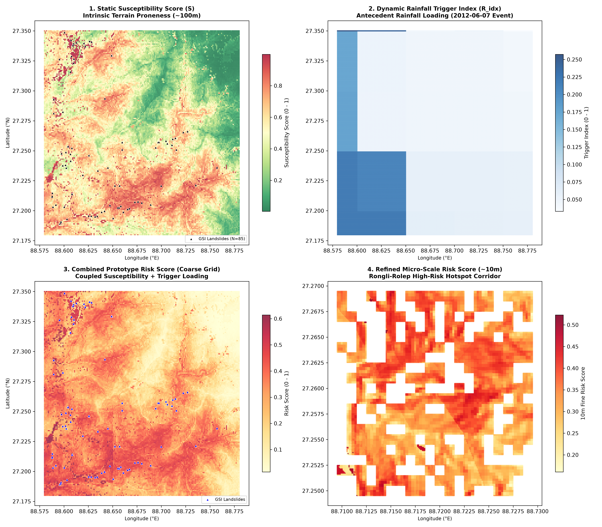

# Prototype Risk Engine (Sikkim Pilot Region) — Technical Documentation

Technical documentation, mathematical formulation, component coupling, and operational limitations for the multi-hazard risk engine prototype developed in **Step 11**.

---

## 1. System Architecture & Objectives

The Sikkim Landslide Risk Engine dynamically combines **static terrain susceptibility** ($S$) with **dynamic hydrological precipitation triggers** ($R_{\text{idx}}$) to produce an integrated, actionable landslide risk score for every spatial grid cell across the pilot corridor.

```
+--------------------------------------------------------------------------------+
|                             STATIC SUSCEPTIBILITY (S)                          |
|  - Topography (Elevation, Slope, Aspect, Curvature via SRTM 30m)               |
|  - Surface Cover (ESA WorldCover 2021 10m)                                     |
|  - Pedology (SoilGrids 250m Clay, Sand, Silt, Bulk Density)                   |
|  ==> Evaluated via Best Trained Classifier (Logistic Regression Pipeline)      |
|  ==> S in [0.0, 1.0] (Intrinsic Terrain Vulnerability)                         |
+---------------------------------------+----------------------------------------+
                                        |
                                        v
                    +---------------------------------------+
                    |        PROTOTYPE RISK COUPLING        |
                    |   Risk = 0.50*S + 0.30*R + 0.20*(S*R) |
                    +---------------------------------------+
                                        ^
                                        |
+---------------------------------------+----------------------------------------+
|                         DYNAMIC RAINFALL TRIGGER (R_idx)                       |
|  - Short-Term Pulse: Event-day rainfall (R_24h, weight = 0.40)                |
|  - Intermediate Infiltration: 3-day antecedent rainfall (R_72h, weight = 0.35)|
|  - Regional Saturation: 7-day cumulative rainfall (R_7d, weight = 0.25)        |
|  ==> Normalized against empirical saturation thresholds (75mm, 100mm, 150mm)   |
|  ==> R_idx in [0.0, 1.0] (Hydrological Trigger Loading)                       |
+--------------------------------------------------------------------------------+
```

---

## 2. Mathematical Formulation & Prototype Weights

### Component 1: Static Susceptibility Score ($S$)

Derived from the validated machine learning pipeline (`models/best_model.joblib`), outputting the posterior probability of slope failure:
$$S = P(\text{Landslide} \mid \mathbf{x}_{\text{terrain}}, \mathbf{x}_{\text{soil}}, \mathbf{x}_{\text{lulc}}) \in [0.0, 1.0]$$

### Component 2: Dynamic Rainfall Trigger Index ($R_{\text{idx}}$)

To capture the distinct physical mechanisms of shallow translational slides (intense short-term pulses) versus deep rotational failures (cumulative water-table rise), the rainfall index integrates three antecedent windows:

$$R_{\text{norm}, 24} = \min\left(\frac{R_{24\text{h}}}{75.0\text{ mm}}, 1.0\right)$$
$$R_{\text{norm}, 72} = \min\left(\frac{R_{72\text{h}}}{100.0\text{ mm}}, 1.0\right)$$
$$R_{\text{norm}, 7\text{d}} = \min\left(\frac{R_{7\text{d}}}{150.0\text{ mm}}, 1.0\right)$$

The compound trigger index is computed as a convex combination:
$$R_{\text{idx}} = w_{24} \cdot R_{\text{norm}, 24} + w_{72} \cdot R_{\text{norm}, 72} + w_{7\text{d}} \cdot R_{\text{norm}, 7\text{d}}$$
where the prototype weights are:

- $w_{24} = 0.40$ (immediate perched water table development)
- $w_{72} = 0.35$ (soil mantle saturation)
- $w_{7\text{d}} = 0.25$ (regional groundwater table elevation)
  $$\sum w = 0.40 + 0.35 + 0.25 = 1.00$$

### Component 3: Combined Risk Score ($\text{Risk}$)

When dynamic rainfall is available:
$$\mathbf{\text{Risk}} = w_S \cdot S + w_R \cdot R_{\text{idx}} + w_{\text{inter}} \cdot (S \times R_{\text{idx}})$$
where the prototype weights are:

- $w_S = 0.50$ (weight of intrinsic terrain susceptibility)
- $w_R = 0.30$ (weight of external hydrological trigger)
- $w_{\text{inter}} = 0.20$ (non-linear geotechnical interaction term)
  $$\sum = 0.50 + 0.30 + 0.20 = 1.00$$

#### Geotechnical Rationale for the Interaction Term $(S \times R_{\text{idx}})$:

- On flat alluvial valleys ($S \approx 0$), extreme rainfall causes surface flooding, but slope shear failure cannot occur ($\text{Risk} \le 0.30$).
- On steep, vulnerable slopes ($S \approx 0.90$), intense rainfall reduces soil suction and effective stress, triggering an immediate non-linear surge in total risk.
- Under dry conditions ($R_{\text{idx}} = 0$), the residual risk reflects baseline terrain proneness ($0.50 \cdot S$).

---

## 3. Strict Missing Rainfall Protocol (Zero Fabrication)

In accordance with project integrity rules:

1. **No Imputation / No Dummy Values:** If rainfall data is unavailable (e.g., radar shadow, communication outage, or uninstrumented valleys), rainfall columns strictly retain `NaN`.
2. **Graceful Fallback to Static Susceptibility:**
   $$\text{Risk} = S$$
3. **Explicit Metadata Flagging:**
   - `rainfall_status = 'unavailable'`
   - `risk_mode = 'static_baseline_only'` (versus `'dynamic_composite'`)
     This guarantees that operators and downstream alert pipelines always know whether an alert is driven by live rainfall telemetry or represents a static baseline hazard.

---

## 4. Prototype Risk Classification Tiers

| Risk Tier          |       Risk Score Range        | Color Code | Operational Meaning (Prototype)                                       | Recommended Action                                            |
| :----------------- | :---------------------------: | :--------: | :-------------------------------------------------------------------- | :------------------------------------------------------------ |
| **Low Risk**       |     $\text{Risk} < 0.35$      |   Green    | Normal baseline conditions. Slopes stable under current weather.      | Standard highway maintenance.                                 |
| **Moderate Risk**  | $0.35 \le \text{Risk} < 0.55$ |   Yellow   | Heightened predisposition or early antecedent rainfall accumulation.  | Issue travel advisories; monitor drainage.                    |
| **High Risk**      | $0.55 \le \text{Risk} < 0.75$ |   Orange   | Severe combined vulnerability. Slope approaching failure threshold.   | Deploy traffic marshals; prepare road-clearing dozers.        |
| **Very High Risk** |    $\text{Risk} \ge 0.75$     |    Red     | Critical failure imminent or active debris flow / rockfall occurring. | Precautionary road closures; evacuate vulnerable settlements. |

> [!IMPORTANT]
> All thresholds ($0.35$, $0.55$, $0.75$) and weights ($0.50, 0.30, 0.20$) are **research prototype values** designed to demonstrate system functionality. They are **NOT** official statutory thresholds sanctioned by the Sikkim State Disaster Management Authority (SSDMA) or National Disaster Management Authority (NDMA).

---

## 5. Evaluation Results across Sikkim Pilot Grids

The risk engine was executed across the Rongli–Pakyong–Singtam pilot corridor using authentic CHIRPS rainfall from the verified June 7, 2012 storm event:

### Coarse Grid (~100m, 34,371 Cells)

- **Susceptibility Score ($S$):** Mean = `0.4983`, Min = `0.0036`, Max = `0.9993`
- **Rainfall Trigger Index ($R_{\text{idx}}$):** Mean = `0.0843`, Min = `0.0332`, Max = `0.2574`
- **Combined Risk Score ($\text{Risk}$):** Mean = `0.2837`, Min = `0.0145`, Max = `0.6141`
- **Risk Category Breakdown:**
  - **Low Risk:** `22,089` cells (**64.27%**)
  - **Moderate Risk:** `11,823` cells (**34.40%**)
  - **High Risk:** `459` cells (**1.34%**)
  - **Very High Risk:** `0` cells (**0.00%**)

### Refined Fine Grid (~10m, 25,400 Cells, Rongli Hotspot)

- **Combined Risk Score ($\text{Risk}$):** Mean = `0.3470`, Min = `0.1557`, Max = `0.5484`
- **Risk Category Breakdown:**
  - **Low Risk:** `13,662` cells (**53.79%**)
  - **Moderate Risk:** `11,738` cells (**46.21%**)
  - **High Risk:** `0` cells (**0.00%**)
  - **Very High Risk:** `0` cells (**0.00%**)

---

## 6. Diagnostic Risk Visualization

The generated diagnostic visualization maps the interaction between static predisposition and dynamic hydrological trigger:



1. **Panel 1 (Static Susceptibility $S$):** Intrinsic terrain proneness across 34,371 coarse cells with 85 historical GSI landslides.
2. **Panel 2 (Dynamic Trigger Index $R_{\text{idx}}$):** Spatial rainfall loading distribution for the June 7, 2012 storm event.
3. **Panel 3 (Combined Prototype Risk):** Coupled hazard score showing how rainfall amplifies risk exclusively on steep, vulnerable slopes.
4. **Panel 4 (Micro-Scale 10m Fine Risk):** Zoomed-in 10-meter risk map for the Rongli-Rolep hotspot corridor.

---

## 7. Output Files & Artifacts

1. **Coarse Grid Risk Dataset (~100m):**
   - [`data/processed/risk/coarse_grid_risk.csv`](../data/processed/risk/coarse_grid_risk.csv) (`34,371` rows)
2. **Refined Fine Grid Risk Dataset (~10m):**
   - [`data/processed/risk/fine_grid_risk.csv`](../data/processed/risk/fine_grid_risk.csv) (`25,400` rows)
3. **Machine-Readable Metadata & Formulation JSON:**
   - [`data/processed/risk/risk_engine_summary.json`](../data/processed/risk/risk_engine_summary.json)
4. **Diagnostic Multi-Panel Risk Map:**
   - [`data/processed/risk/risk_diagnostic_map.png`](../data/processed/risk/risk_diagnostic_map.png)
   - [risk_diagnostic_map.png](screenshots/risk_diagnostic_map.png)
5. **Reproducible Pipeline Script:**
   - [`scripts/run_risk_engine.py`](../scripts/run_risk_engine.py)

---

## 8. Operational Limitations & Caveats

> [!CAUTION]
> **Scientific & Engineering Limitations:**
>
> 1. **Research Prototype:** This risk engine is an academic software prototype developed for algorithm demonstration. It has not undergone operational certification by official geotechnical authorities.
> 2. **Rainfall Delay / Satellite Resolution:** CHIRPS satellite-derived rainfall has a native resolution of $0.05^\circ$ (~5 km) and a 1-day reporting latency. Real-time early warning requires local automated weather station (AWS) rain gauges or Doppler weather radar.
> 3. **Absence of Real-Time Geotechnical Telemetry:** The engine does not ingest live borehole piezometer pore pressures, inclinometers, or fiber-optic strain data.
> 4. **Micro-Scale Features:** Sub-30m drainage culverts, retaining walls, and roadside cuts are not explicitly captured by the static DEM.
